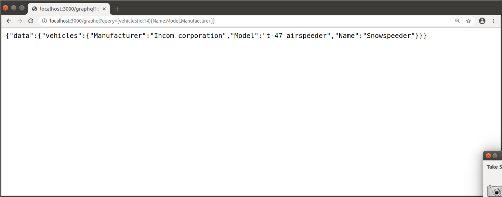

# Swapi

16340216

一个简单的服务端，通过浏览器访问

## 运行

```powershell
# 先安装一些github库
go get github.com/boltdb/bolt
go get github.com/dgrijalva/jwt-go
go get github.com/graphql-go/graphql
go get github.com/graphql-go/graphql-go-handler
# 在主目录下
go run struct.go db.go main.go
# 会出现 2020/01/06 02:17:32 Please visit the http://localhost:9999/Graphql...
```

## 测试

```powershell
# graphql 可以不用返回整个planet的json字符串，而是取出其中特定的元素
http://localhost:9999/Graphql?query={vehicles(id:14){Name,}}
http://localhost:9999/Graphql?query={vehicles(id:14){Name,Model,Manufacturer,}}
```



```powershell
http://localhost:9999/Graphql?query={planets(id:1){Name,RotationPeriod,OrbitalPeriod,}}
```


## 其他URL实例

```powershell
http://localhost:9999/Graphql?query={people(id:1){Name,Height,Mass,HairColor,SkinColor,EyeColor,BirthYear,Gender,Homeworld,FilmURLs,SpeciesURLs,VehicleURLs,StarshipURLs,Created,Edited,URL,}}

http://localhost:9999/Graphql?query={films(id:1){Title,EpisodeID,OpeningCrawl,Director,Producer,CharacterURLs,PlanetURLs,StarshipURLs,VehicleURLs,SpeciesURLs,Created,Edited,URL,}}

http://localhost:9999/Graphql?query={planets(id:1){Name,RotationPeriod,OrbitalPeriod,Diameter,Climate,Gravity,Terrain,SurfaceWater,Population,ResidentURLs,FilmURLs,Created,Edited,URL,}}

http://localhost:9999/Graphql?query={Species(id:1){Name,Classification,Designation,AverageHeight,SkinColors,HairColors,EyeColors,AverageLifespan,Homeworld,Language,PeopleURLs,FilmURLs,Created,Edited,URL,}}

http://localhost:9999/Graphql?query={vehicles(id:14){Name,Model,Manufacturer,CostInCredits,Length,MaxAtmospheringSpeed,Crew,Passengers,CargoCapacity,Consumables,VehicleClass,PilotURLs,FilmURLs,Created,Edited,URL,}}

http://localhost:9999/Graphql?query={starships(id:1){Name,Model,Manufacturer,CostInCredits,Length,MaxAtmospheringSpeed,Crew,Passengers,CargoCapacity,Consumables,HyperdriveRating,MGLT,StarshipClass,PilotURLs,FilmURLs,Created,Edited,URL,}}

```


